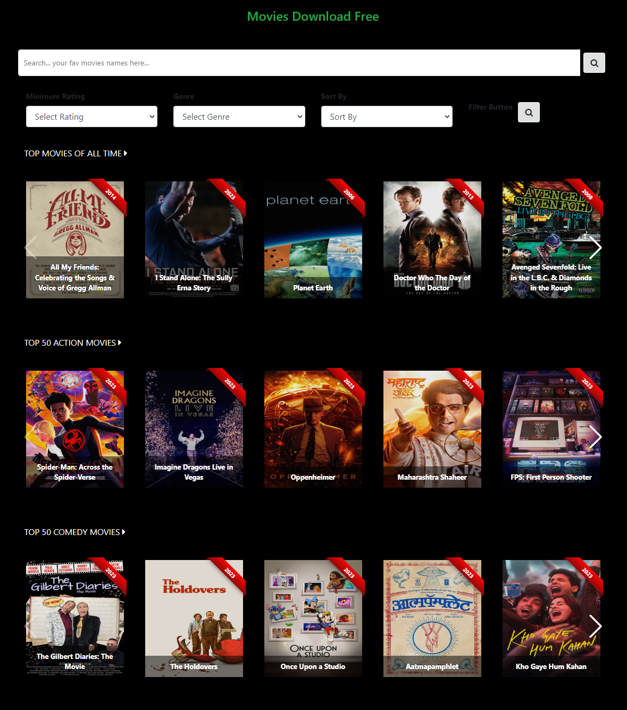

 # Curated Movies: Discover and Download Torrents with Ease

**Unleash your movie nights with a curated collection of top-rated films and convenient torrent downloads.**

 <h3>Home Page</h3>

## Features

- **Explore Curated Collections:**
    - Dive into the top 50 movies of all time.
    - Browse genres like comedy, action, romance, sci-fi, horror, adventure, and animation.
- **Powerful Search:**
    - Find specific movies effortlessly with the search bar.
- **Refine Your Results:**
    - Filter movies by genre, rating, and year.
    - Sort movies by title, rating, or year.
- **Download Effortlessly:**
    - Access torrent files for different resolutions with a single click.

## Installation and Usage

1. **Prerequisites:**
    - Python 3.7+
    - Flask
    - Requests library
    

2. **Setting Up:**
    - Clone the repository or download the code.
    - Install dependencies: `pip install flask requests`
    - Run the application: `python app.py`

3. **Exploring Movies:**
    - Visit http://localhost:5000/ in your browser.
    - Browse curated lists or use the search bar.
    - Apply filters and sorting as needed.

4. **Downloading Torrents:**
    - Click on the desired resolution to initiate the download.

## Screenshots

- Curated movie lists
- Search functionality
- Filter and sorting options
- Movie details page
- Download buttons

## Important Notes

- This application is for educational and personal use only.
- Download and share content responsibly and legally.
- Respect copyright laws and regulations.
- Refer to the YTS API terms and conditions.

## License

This project is licensed under the MIT License.

## Contact

For questions or feedback, contact [Your Name/Email]

**Enjoy your movie journey!**
